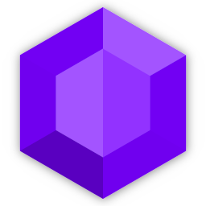

   <div align="center">



# Gloss

Server polish and display suite: holograms, scoreboards, tablist, emoji chat, chat bubbles and damage indicators — in one plugin.

</div>

## Features

- **Holograms** — TextDisplay-based floating text with per-player placeholder rendering, hotloadable JSON files, text-to-block-art rendering and full command management.
- **Scoreboards** — JSON-defined sidebars with primary/world defaults, permission-gated boards and per-group defaults.
- **Tablist** — configurable header/footer and per-group player list names.
- **Emoji** — `:emoji:` and trigger replacement in chat with tab completion and per-emoji permissions.
- **Chat bubbles** — messages float above the speaker's head, stack, and fly away as they expire.
- **Damage indicators** — floating damage and heal numbers with ballistic motion, measured from actual applied health deltas.
- **Animations** — frame-based text animations usable in any hologram, board or tablist line via `|animation.<id>|`.
- **MOTD** — randomized, color-filtered server list MOTD.

Rendered text supports bounded `{{ ... }}` expressions with native `player.*` and `server.*` values. PlaceholderAPI remains optional: `papi(...)` and `papiNumber(...)` use it when installed, while the standard player and server keys resolve from Gloss itself when it is absent.

## Requirements

- A 26.1.2 – 26.2 server: Paper, Purpur, Leaf, Folia, Canvas or Spigot.
- Java 25.
- Optional: PlaceholderAPI (placeholders in any rendered line), Vault (permission-group tablist names and default boards).

## Commands

`/gloss` (aliases `gl`, `glo`, `gg`) is the root; `/hologram` (`holo`, `h`) and `/board` (`sb`, `bd`) jump straight into their subtrees. Run `/gloss help` in game for the full paged menu.

## Building

```
./gradlew build       # full gate: tests + spigot-compatibility compile + shaded jar
./gradlew shadowJar   # just the plugin jar
```

Java 25 is required. The local `VolmLib` sibling checkout is resolved automatically as a composite build; pass `-PuseLocalVolmLib=false` to resolve it remotely instead.

## Data layout

Gloss never creates a folder it has nothing to put in. Only `config.toml` and the shipped defaults
of enabled features exist after a first boot; every other folder appears the moment something is
written into it, and stays gone otherwise.

```
plugins/Gloss/
├── config.toml                      always
├── language.yml                     always
├── tablist.json                     shipped default, while tablist is enabled
├── motd.json                        shipped default, while motd is enabled (off by default)
├── boards/<id>.json                 shipped default, while boards are enabled
├── emoji/<id>.json                  shipped defaults, while emoji is enabled
├── animations/<id>.json             shipped default, while animations are enabled
├── bubbles/<id>.json                shipped default, while chat bubbles are enabled
├── previews/<name>.json             shipped defaults, while container previews are enabled
├── holograms/<id>.json              on the first hologram
├── menus/<path>.json                on the first menu
├── images/<path>                    when an operator drops an image in
├── panels/<path>.json               on the first panel
├── editor-sync-transactions/        during an editor sync publication
├── editor-sync-backups/<id>/        on the first completed editor sync publication
└── import-backups/<timestamp>/      on a legacy data import that has something to migrate
```

All data files hotload — edit them on disk and the change applies in game without a reload. Deleting
a folder is safe: Gloss reads what is there and recreates only what it writes. `panels/` is the one
exception to hotloading and reloads through `/gloss panel reload`.
